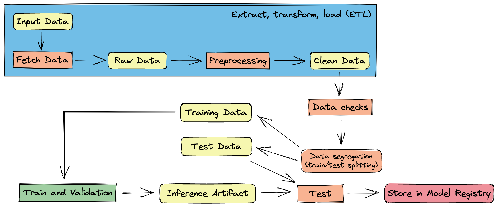

# Classifying Disaster-Related Tweets as Real or Fake

## Big picture

Neste projeto, foi treinado um modelo de aprendizado profundo baseado em Transformer com o intuito de classificar quais tweets são sobre desastres reais e quais não são. Utilizou-se a solução do [Dataquest](https://github.com/dataquestio/solutions/blob/master/Mission797Solutions.ipynb) como base para aplicar as melhores práticas de machine learning operations (MLOps), bem como os princípios vistos no [primeiro projeto](../Python_Essentials_for_MLOps). Além disso, foi utilizado o Apache Airflow para criar uma Direct Acyclic Graph (DAG) que automatiza a execução dos scripts e, por fim, tudo isso foi integrado à plataforma Weights & Biases (Wandb) para realizar o rastreamento dos artefatos gerados ao longo da execução e das métricas obtidas.

O conjunto de dados é proveninete do [Kaggle](https://www.kaggle.com/competitions/nlp-getting-started/overview), em particular, da competição Natural Language Processing with Disaster Tweets, a qual tem como objetivo ser uma porta de entrada para cientistas de dados que querem desbravar o mundo de NLP. Nesse sentido, o objetivo é realizar processamentos na coluna `text` de forma a melhorar a predição dos modelos na classificação do tweet. Ao todo, o dataset possui as seguintes colunas: 

- `id` - a unique identifier for each tweet
- `text` - the text of the tweet
- `location` - the location the tweet was sent from (may be blank)
- `keyword` - a particular keyword from the tweet (may be blank)
- `target` - in `train.csv` only, this denotes whether a tweet is about a real disaster (1) or not (0)

A figura abaixo ilusta o passo-a-passo que será executado pela DAG, onde em laranja têm-se uma etapa executada e, em amarelo, um artefato gerado pela respectiva etapa. Nesse sentido, o pipeline é composto por sete passos, os quais serão detalhados nas sub-seções a seguir.



### 1 - Fetch Data

O primero passo para todo projeto de machine learning ou data science é realizar o download dos dados. Então, é possível automatizar esse processo com um script que puxa os dados da fonte, seja uma API, um banco de dados, web scraping, entre outros. No contexto deste projeto, foi utilizado o comando `wget` para baixar os dados do Kaggle e depois utilizou-se o Wandb para armazenar estes dados. O código resumido pode ser conferido abaixo.

```python
# download datasets
!wget https://dsserver-prod-resources-1.s3.amazonaws.com/nlp/train.csv

# Login to Weights & Biases
!wandb login --relogin

# send the raw_data to the wandb and store it as an artifact
!wandb artifact put \
      --name tweet_classifying/raw_data \
      --type RawData \
      --description "Real and Fake Disaster-Related Tweets Dataset" raw_data.csv
```

### 2 - Exploratory Data Analysis (EDA)

Nesta etapa, você pode realizar a automação da EDA por meio da geração de logs das distribuição estatística das colunas do dataset, por exemplo, ou gerar gráficos para poder realizar visualizações mais complexas posteriormente. Então, para fazer isso, realiza-se o download dos dados provenientes do passo anterior, realiza-se as análises e, por fim, sobe os artefatos para o Wandb. Abaixo, encontra-se um código resumo que faz o processo mencionado anteriormente e envia um gráfico em formato de imagem para o Wandb.

```python
# Initialize wandb run
wandb.init(project='tweet_classifying', save_code=True)

# Get the artifact
artifact = wandb.use_artifact('raw_data:latest')

# Download the content of the artifact to the local directory
artifact_dir = artifact.download()

# read data
df = pd.read_csv(artifact.file())

# ploting figure
freq_target = df['target'].value_counts()

fig, ax = plt.subplots(figsize=(12,7))
freq_target.plot(kind='bar',alpha=1, rot=0, colormap=plt.cm.tab10)

plt.title('Tweet Count by Category', size=20)
ax.spines["top"].set_visible(False)
ax.spines["left"].set_visible(False)
ax.spines["right"].set_visible(False)
ax.spines["bottom"].set_visible(False)
ax.tick_params(top="off", left="off", right="off", bottom='off')
plt.savefig('target_distribution.png')  # Save the plot to a file
plt.show()
plt.close()

# Log the histogram image to wandb
wandb.log({"Target Distribution": wandb.Image('target_distribution.png')})

# finish run
wandb.finish()
```


É improtante destacar que isso é bastante útil quando as colunas e os tipos dos seus dados já são bem conhecidos.

## How to execute [ATUALIZAR]

Once the dependencies are installed, simply execute the following command, replacing "movie-title" with the title of the movie you desire.

```
python movie_recomendation.py --movie-title "Movie Title"
```

### Execution Example[ATUALIZAR]

Let's take an example where you want to search for movie recommendations similar to "Super Mario."

```
python movie_recomendation.py --movie-title "Super Mario"
```

The output in your terminal should resemble what is shown in the image below.


## The code

In the file [movie_recomendation.py](./movie_recomendation.py), the `try - except` architecture is used to check if the data directory already exists and then to perform the actual data download from the URL. To achieve this, the [tqdm](https://github.com/tqdm/tqdm) library is utilized to display a progress bar in the terminal, providing the user with an estimate of the download time or confirming that the program is still executing as expected. If it fails to do so, the program will raise an exception and inform the user about the error.

```python
try:
    if not os.path.exists("ml-25m"):
        logging.info("Downloading the data")

        download_data(os.getenv("URL"), os.getenv("ZIP_FILENAME"))
    else:
        logging.info("The data is already downloaded")
except requests.exceptions.ConnectionError:
    logging.error("Connection Error")
except requests.exceptions.Timeout:
    logging.error("Timeout Error")
except requests.exceptions.HTTPError:
    logging.error("HTTP Error")
except zipfile.BadZipFile:
    logging.error("The downloaded file is not a valid ZIP file.")
```

With the data in its proper place, you can instantiate the object that will receive and process the arguments provided on the command line, which is the `ArgumentParser`. At this point, the program will perform the following tasks:

1. Verify the format of the title provided.
2. Load the dataset.
3. Clean the special characters present in the movie titles.

```python
# create the parser
parser = argparse.ArgumentParser(description="Movie Recommendation System")

# add the arguments
parser.add_argument("--movie_title", type=str, help="The title of the movie")

# parse the arguments
args = parser.parse_args()

# get the movie title
movie_title = args.movie_title

# import the data
logging.info("Importing the data")
movies_df = pd.read_csv("data/movies.csv")

# log the shape of the data
logging.info(f"The shape of the data is {movies_df.shape}")

# clean the movie title
logging.info("Cleaning the movie title")
movies_df["clean_title"] = movies_df["title"].apply(clean_movie_title)
```

Next, a `TfidfVectorizer` was instantiated to transform movie titles into vectors, allowing us to search for movies with similar titles. Okay, that's pretty cool already, but let's agree that we can do better than that, right? How about recommending similar movies based on the consumption and ratings of other users?

```python
# instantiate the TF-IDF vectorizer
logging.info("Instantiating the TF-IDF vectorizer")
tfidf_vectorizer = TfidfVectorizer(ngram_range=(1,2))

# fit the vectorizer and transform the data
logging.info("Fitting and transforming the data")
tfidf_matrix = tfidf_vectorizer.fit_transform(movies_df["clean_title"])

# get the most similar movies
logging.info(f"Getting the most similar movies to {movie_title}")
results = get_most_similar_movies_by_title(movies_df, tfidf_vectorizer, movie_title)
```

No arquivo [ratings.csv](./data/ratings.csv), nós podemos encontrar a nota que cada usuário deu para um determinado `movieId` e, através dessa coluna, nós podemos pegar o respectivo nome do filme no arquivo [movies.csv](./data/movies.csv). A função responsável por realizar essa busca é definida como `find_similar_movies()` e pode ser encontrada no arquivo [utils.py](./utils.py).


In the file [ratings.csv](./data/ratings.csv), we can find the rating that each user gave to a specific movieId, and through this column, we can retrieve the corresponding movie name from the file [movies.csv](./data/movies.csv). The function responsible for performing this search is defined as `find_similar_movies()` and can be found in the file [utils.py](./utils.py).

```python
# movie_recomendation.py

# read the ratings data
ratings_df = pd.read_csv("data/ratings.csv")

results = find_similar_movies(movies_df, ratings_df, movie_title)
```

## How to add more movies (Pytest)

Every day, new movies are released, and as a result, it is desirable to keep our database updated, isn't it? So, if you want to do this without compromising the correct execution of the code, I have created some tests that will reduce the chance of any problems occurring during execution.

In the file [conftest.py](./conftest.py), you will find a fixture that loads the datasets into memory so they can be used in the tests. In the file [test_data.py](./test/test_data.py), you will find tests that check, for example, if the data types of each column are as expected, if there is a minimum number of desirable rows, if the datasets have columns with the expected names, among other things. Feel free to add more tests to your application; they are very important and can save a lot of debugging time.

To run all the tests, simply execute the command below:

```
pytest
```

To run a specific test file, you can pass the file name, for example:

```
pytest test/test_data.py
```

The result of executing this command can be seen in the image below:


## Clean codes Principles

Note that, compared to the [original solution](https://github.com/dataquestio/solutions/blob/master/Mission740Solutions.ipynb), several variable and function names have been changed to make the code more readable. Additionally, some steps of the pipeline have been modularized, exception handling has been added, and logging has been incorporated. Furthermore, documentation for functions has been provided, including docstring format and type hints, as shown in the example function below:

```python
def clean_movie_title(raw_movie_title: str) -> str:
    """
    Clean the title of the movie by removing any non-alphanumeric characters

    Args:
        raw_movie_title (str): The raw title of the movie

    Returns:
        movie_title_cleaned (str): The clean title of the movie
    """
    movie_title_cleaned = re.sub("[^a-zA-Z0-9 ]", "", raw_movie_title)
    return movie_title_cleaned
```

## Code style

Please note that I tried to make variable names as readable as possible, as well as test names. In addition to the docstring, the code became cleaner and more readable, thus improving its overall readability. Regarding Pylint, I achieved a score of 10/10. However, don't become overly obsessed with reaching the maximum score. It's essential to use good judgment and be critical about certain things, such as the number of spaces in indentation, as it may vary depending on the screen resolution you are working with; sometimes two spaces might be more appropriate than four.

To run Pylint, you can simply execute the following command:

```
pylint filename
```

Below are some examples of execution and their results:

- ```pylint movie_recomendation.py```


- ```pylint conftest.py```


- ```pylint utils.py```


## Copyrights

This project was adapted from a `Portfolio Project` on the [Dataquest](https://www.dataquest.io/) website. Compared to the [original solution](https://github.com/dataquestio/project-walkthroughs/blob/master/movie_recs/movie_recommendations.ipynb), it involved transforming a Jupyter notebook with an interactive recommendation system into Python scripts to facilitate and enable the use of Pylint, AutoPep8, and command-line argument passing.

## References

- [Ivanovitch's Repository](https://github.com/ivanovitchm/mlops)
- [Build a Movie Recommendation System in Python (Dataquest)](https://github.com/dataquestio/project-walkthroughs/blob/master/movie_recs/movie_recommendations.ipynb)
