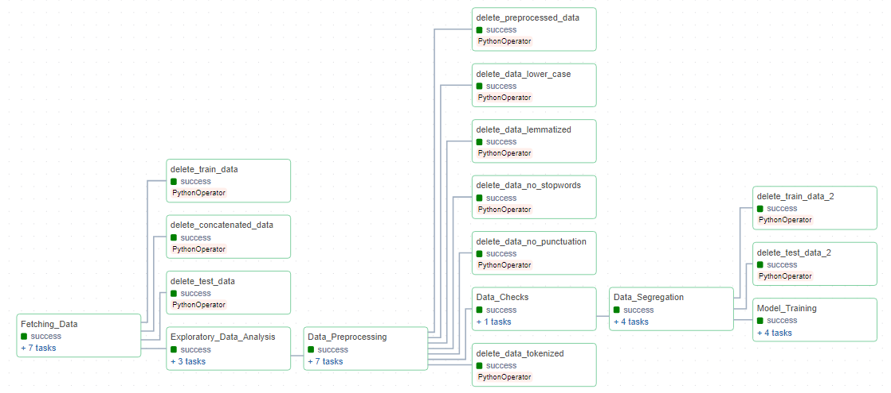
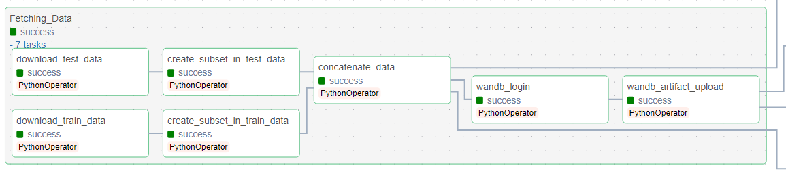
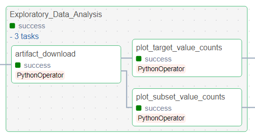
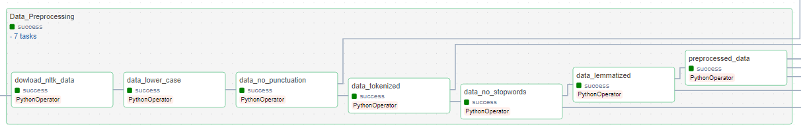
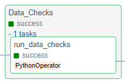
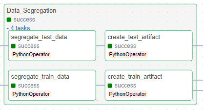
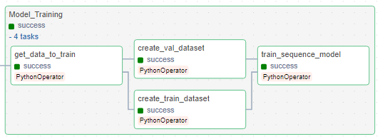
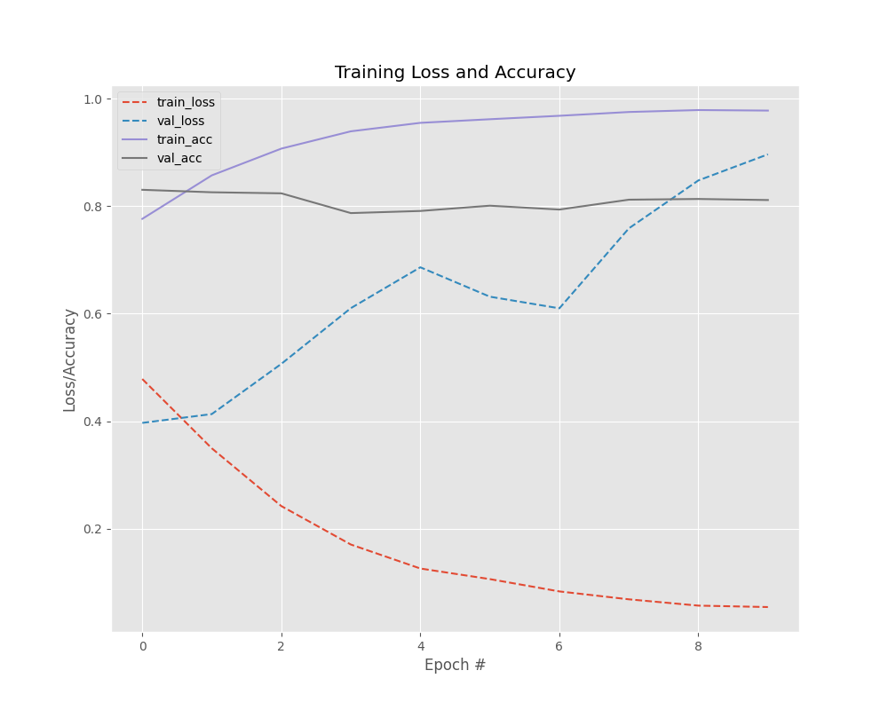
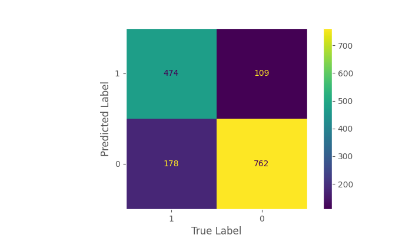

# Classifying Disaster-Related Tweets as Real or Fake

## Big picture

In this project, a pipeline was developed using Apache Airflow integrated with **[Weights & Biases (Wandb)](https://wandb.ai/site)** for training a deep learning model based on Transformer to classify which tweets are about real disasters and which are not. The **[Dataquest](https://github.com/dataquestio/solutions/blob/master/Mission797Solutions.ipynb)** solution was used as a basis to apply the best practices in machine learning operations (MLOps), as well as the principles seen in the **[first project](../Python_Essentials_for_MLOps)**.


The dataset comes from **[Kaggle](https://www.kaggle.com/competitions/nlp-getting-started/overview)**, specifically from the Natural Language Processing with Disaster Tweets competition, which aims to be a gateway for data scientists who want to explore the world of NLP. In this sense, the goal is to process the `text` column in order to improve the prediction of the models in classifying the tweet. The dataset has the following columns:

- `id` - a unique identifier for each tweet
- `text` - the text of the tweet
- `location` - the location the tweet was sent from (may be blank)
- `keyword` - a particular keyword from the tweet (may be blank)
- `target` - in `train.csv` only, this denotes whether a tweet is about a real disaster (1) or not (0)

The figure below illustrates the step-by-step process that will be executed by the DAG, where in orange there is a step executed, and in yellow, an artifact generated by the respective step. Each artifact generated in one step is then passed to the next step, like an assembly line. In this sense, the pipeline consists of seven steps, which will be detailed in the following subsections.

<p align="center">
  
</p>


## Pipeline

**[Apache Airflow](https://airflow.apache.org)** was used to create a DAG that automates the execution of scripts in a way that everything is integrated into the **[Weights & Biases (Wandb)](https://wandb.ai/site)** platform to track the artifacts generated throughout the execution and the obtained metrics. The figure below illustrates the DAG created for this project:

<p align="center">
  
</p>

### 1 - Fetch Data

The first step is to pull data from somewhere, whether via API, database, web scraping, among others. In this sense, tasks were created to download data from Kaggle, create a new column called `subset`, concatenate the two datasets and upload them to wandb.

<p align="center">
  
</p>

### 2 - Exploratory Data Analysis (EDA)

The next step is to perform exploratory data analysis (EDA), which is represented in this step by tasks that plot graphs related to the statistical distribution of labels and the proportion between training and testing.

<p align="center">
  
</p>


### 3 - Preprocessing

In this stage, the goal is to process the data so that it is ready to be trained and tested. In this sense, the processes performed vary greatly depending on the nature of the problem. In the context of this project, the text underwent the following processes:

1. Lowercase
2. Removing punctuations and numbers
3. Tokenization
4. Removing Stopwords
5. Lemmatization

The described processes were applied to the raw data downloaded in the first step, as shown in the summarized code below. All auxiliary functions used are in the file [preprocessing_helper.py](./preprocessing_helper.py)

<p align="center">
  
</p>

### 4 - Data Checks

Before training or retraining a model, it is important to check the statistical distribution of the datasets to avoid data drift. Therefore, in this step, three tests were performed on the clean data to verify if the label column had the expected values, if the dataset had at least 1000 lines, and if the text column is of the object type. The task shown in the image below triggers all tests at once.

<p align="center">
  
</p>

### 5 - Data Segregation 

It's important to perform the division between training and test data so that data leakage does not occur. Therefore, this step is dedicated to dividing the clean dataset between the two mentioned categories so that the test dataset is completely isolated from the training dataset. The tasks perform the division and upload the generated artifacts.

<p align="center">
  
</p>

**Important**: In this case, the dataset already had a column that informs the training portion and the test portion. However, in general, you can use the `train_test_split` function from the [Scikit-learn](https://scikit-learn.org/stable/modules/generated/sklearn.model_selection.train_test_split.html) library.

### Train and validation

Once the data is clean and divided, it is possible to proceed to the model for training. In the context of this project, `TFAutoModelForSequenceClassification`, a model based on the transformers architecture of HuggingFace, was used. In this sense, the tasks below take the training set and divide it between training and validation.

Regarding the original solution, other increments were made such as the generation of a graph with accuracy and loss curves, generation of the confusion matrix, and tracking the amount of CO2 emitted into the atmosphere, as well as the use of computational resources during the training of the model. All this information was summarized and sent to Wandb after the end of this stage. 

<p align="center">
  
</p>

### 7 - Test

Finally, there is the test stage of the trained model with the dataset that it has never seen. However, this step is not yet available, as the Kaggle competition has not yet ended. So, the real labels of the test set are not yet available.

## Results

The graph of accuracy and loss for both the training and validation set is illustrated in the figure below.


<p align="center">
  
</p>

The resulting confusion matrix is illustrated in the figure below.

<p align="center">
  
</p>

The metrics obtained are below:

- Train Accuracy: 0.9780
- Validation Accuracy: 0.8116
- Train Loss: 0.0542
- Validation Loss: 0.8966

- Energy consumed for RAM: 0.000589 kWh
- Energy consumed for all GPU: 0.008069 kWh
- Energy consumed for all CPU: 0.005263 kWh
- CO2 emission 0.006301 (in Kg)

It is important to note that these figures illustrate the training carried out on Google Colaboratory, due to training time reasons. In the Airflow pipeline, training was configured for only one epoch on CPU for validation purposes. In addition, the batch size of the training was reduced to meet the limitations of the Docker container. Future work involves setting up a more robust container configured to use the GPU.


## Getting Started

### Prerequisites

- Wandb account
- Docker

### How to execute

1 - Clone this repoitory.

```bash
git clone https://github.com/Morsinaldo/mlops2023.git
```

2 - Enter in `Classifying_Tweets` folder.

```bash
cd Classifying_Tweets
```

3 - Create a [Weights & Biases](https://wandb.ai/) account.

4 - Go to [API Keys](https://wandb.ai/authorize) page and copy your key.

5 - Paste the generated key into the `WANDB_API_KEY` field in the [Dockerfile](./Dockerfile).

```Dockerfile
ENV WANDB_API_KEY = "your_key"
```

6 - Build the cointainer

```bash
docker compose up --build
```

7 - Access `http://localhost:8080` and put the following login.

```bash
Username: airflow
Password: airflow
```

After that, DAG will be available in the main page. You can trigger it manually.

## Copyrights

This project was adapted from a `Guided Project` on the [Dataquest](https://www.dataquest.io/) website. Compared to the [original solution](https://github.com/dataquestio/solutions/blob/master/Mission797Solutions.ipynb), it involved transforming a Jupyter notebook into Python scripts to facilitate and enable the use with the Apache Airflow.

## References

- [Ivanovitch's Repository](https://github.com/ivanovitchm/mlops)
- [Build a Movie Recommendation System in Python (Dataquest)](https://github.com/dataquestio/solutions/blob/master/Mission797Solutions.ipynb)
