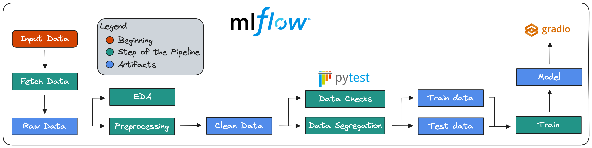
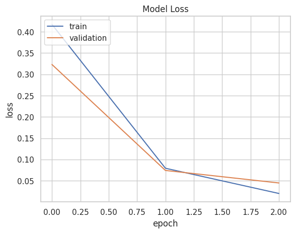
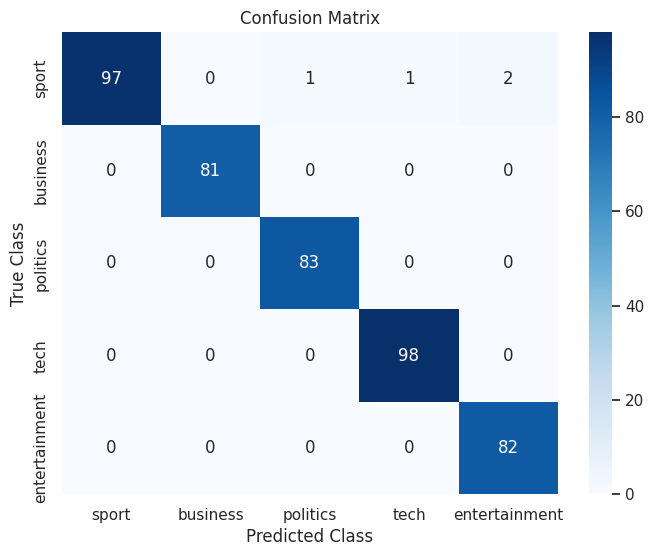

# Multiclass Text Classification

## Big Picture

Neste projeto, foi desenvolvido um pipeline para a classificação multiclasse de textos utilizando o [MLFlow](https://mlflow.org/) para orquestrar a execução dos scripts e o [Gradio](https://www.gradio.app/) para realizar consumir o modelo e realizar a inferências. A solução original está disponível no [Github](https://github.com/Snigdho8869/Multiclass-Text-Classification/blob/main/Notebook/Multiclass_Text_Classification.ipynb) e, a partir dela, foram utilizadas as melhores práticas de Machine Learning Operations (MLOps) vistas no [primeiro projeto](../Python_Essentials_for_MLOps/). O conjunto de dados BBC-text é uma coleção de notícias coletadas pela BBC entre 2004 e 2005 e pode ser encontrado no site do [Hugging Face](https://www.kaggle.com/code/yufengdev/bbc-text-categorization). Ao todo, ele possui 2.225 documentos e duas colunas:

- `category`: Contém os rótulos dos textos (`sport`, `business`, `politics`, `tech`, `entertainment`)
- `text`: Contém o texto das notícias coletadas.

## Pipeline

Ao todo, o pipeline desenvolvido consistem em seis passos, onde uma caixa em verde representa um script executado e em azul representa o artefato de saída daquele passo. Na última parte, o artefato do modelo treinado é consumido pelo Gradio para que um usuário possa realizar inferências a partir de um texto. A figura abaixo demonstra o pipeline completo.



### Fetch Data

O primeiro passo consiste na aquisição dos dados a partir de uma fonte. Nesse caso, está sendo realizada uma requisição get do site do Hugging Face, mas esse passo pode ser generalizado para realizar o download dos dados de qualquer fonte, seja Amazon, Firestore, Google Cloud Platform etc. A saída deste passo é o dado bruto puxado da fonte.

### EDA

A análise exploratória dos dados utiliza os dados brutos como entrada e nela é possível gerar gráficos com a proporção dos rótulos em cada classe, a distribuição estatística das variáveis numéricas, entre outras análises. Nesse caso, como o dataset possui apenas duas colunas, gerou-se apenas um gráfico com a distribuição dos rótulos. Ao final, este passo não gera nenhum artefato no pipeline.

### Preprocessing

Este passo também recebe como entrada os dados brutos e é responsável por deixar os dados limpos. Neste caso, todo o texto está sendo colocado em minúsculo, as pontuações e as stopwords estão sendo removidas e, por fim, é realizada a tokenização das palavras.

### Data Checks

Este passo recebe como entrada os dados limpos do passo anterior e não gera artefato ao final da sua execução. Ele é responsável por realizar testes utilizando o Pytest para verificar se os dados estão como esperado para que possa seguir para os próximos passos. Por exemplo, as colunas possuem rótulos esperados? Os nomes das colunas estão corretos? O conjunto de dados é grande o suficiente para treinar o modelo? Entre outros testes.

### Data Segregation

Este passo recebe como entrada os dados limpos e tem como objetivo realizar a divisão entre treinamento e teste. Em partiular, neste caso está sendo realizada uma divisão na proporção de 80% para treinamento e 20% para teste. Nesse sentido, os conjuntos de dados ficaram com respectivamente 1780 e 445 samples.

### Train

Este passo recebe os conjuntos de dados divididos anteriormente e realiza o treinamento de um modelo Bert por três épocas. A saída deste passo é justamente o artefato do modelo treinado, o qual é consumido posteriormente pelo Gradio.

## Results

O treinamento do modelo Bert resultou nas seguintes métricas:

loss: 0.0200 - accuracy: 0.9955 - val_loss: 0.0447 - val_accuracy: 0.9910

O gráfico da acurácia e do custo ao longo das épocas pode ser visto abaixo.



A matriz de confusão resultante pode ser vista abaixo.



## How to execute 
1 - Crie o ambiente virtual

```bash
conda env create -f environment.yml
```

2 - Abra um terminal e execute o server do mlflow

```bash
mlflow server --host 127.0.0.1 --port 5000
```

3 - Em outro terminal, execute o arquivo `main.py`

```bash
python main.py
```

4 - Execute o Gradio

```bash
python app.py
```

## Copyrights

Esse projeto foi adaptado de uma solução encontrada no [Github](https://github.com/Snigdho8869/Multiclass-Text-Classification/blob/main/Notebook/Multiclass_Text_Classification.ipynb). As modificações realizadas incluem um fluxo de execução contínuo e segmentato em blocos, onde cada um possui uma função específica e a aplicação das melhores práticas de código limpo, linting etc.

## References 

- [Ivanovitch's Repository](https://github.com/ivanovitchm/mlops)
- [Original Solution](https://github.com/Snigdho8869/Multiclass-Text-Classification/blob/main/Notebook/Multiclass_Text_Classification.ipynb)