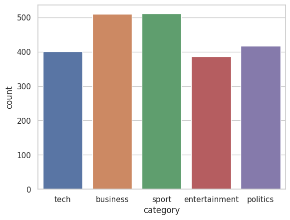
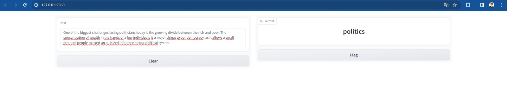

# Multiclass Text Classification

## Big Picture

In this project, a pipeline was developed for the multiclass classification of texts using [MLFlow](https://mlflow.org/) to orchestrate the execution of scripts and [Gradio](https://www.gradio.app/) to consume the model and make inferences. The original solution is available on [Github](https://github.com/Snigdho8869/Multiclass-Text-Classification/blob/main/Notebook/Multiclass_Text_Classification.ipynb), and from it, the best practices of Machine Learning Operations (MLOps) seen in the [first project](../Python_Essentials_for_MLOps/) were utilized. The dataset used is the BBC-text, a collection of news gathered by the BBC between 2004 and 2005. It can be found on the [Hugging Face](https://www.kaggle.com/code/yufengdev/bbc-text-categorization) website. The dataset consists of 2,225 documents and two columns:

- `category`: Contains the labels of the texts (`sport`, `business`, `politics`, `tech`, `entertainment`)
- `text`: Contains the text of the collected news.

## Pipeline

The developed pipeline consists of six steps in total, where a green box represents an executed script, and a blue box represents the output artifact of that step. In the final part, the artifact of the trained model is consumed by Gradio, allowing a user to make inferences from a given text. The figure below illustrates the complete pipeline.

<div align="center">
  
</div>

### Fetch Data

The first step involves acquiring data from a source. In this case, a GET request is made to the Hugging Face website. However, this step can be generalized to download data from any source, whether it be Amazon, Firestore, Google Cloud Platform, etc. The output of this step is the raw data pulled from the source.

### EDA

The exploratory data analysis (EDA) utilizes the raw data as input, allowing the generation of various graphs such as the proportion of labels in each class, the statistical distribution of numeric variables, among other analyses. In this case, as the dataset has only two columns, a graph depicting the distribution of labels was generated. Importantly, this step does not produce any artifact in the pipeline.

<div align="center">
  
</div>

### Step 3: Preprocessing

This step also takes the raw data as input and is responsible for cleaning the data. In this case, all text is converted to lowercase, punctuation and stopwords are removed, and finally, word tokenization is performed.

### Step 4: Data Checks

This step takes the cleaned data from the previous step as input and does not generate any artifact at the end of its execution. It is responsible for running tests using Pytest to verify if the data is as expected, ensuring it can proceed to the next steps. For example, do the columns have expected labels? Are the column names correct? Is the dataset large enough to train the model? Among other tests.

### Step 5: Data Segregation

This step takes the cleaned data as input and aims to perform the split between training and testing. In this case, a split of 80% for training and 20% for testing is performed. Thus, the datasets have 1780 and 445 samples, respectively.

### Step 6: Train

This step receives the datasets divided in the previous step and carries out the training of a Bert model for three epochs. The output of this step is precisely the artifact of the trained model, which is subsequently consumed by Gradio.

## Results

The training of the Bert model resulted in the following metrics:

- **Train loss**: 0.0200
- **Train accuracy**: 0.9955
- **Validation loss**: 0.0447
- **Validation accuracy**: 0.9910

### Training Visualization

<div align="center">
  
</div>

### Confusion Matrix

<div align="center">
  
</div>

## Gradio

With the model saved, Gradio can load it and perform inferences from an input text. In the example below, the input was a text that talks about politics and, when making the prediction, the model categorized it accurately.

<div align="center">
  
</div>

## How to execute

1 - Create the virtual environment

```bash
conda env create -f environment.yml
```

2 - Open a terminal and run the mlflow server

```bash
mlflow server --host 127.0.0.1 --port 5000
```

3 - In another terminal, run the `main.py` file

```bash
python main.py
```

4 - Execute Gradio

```bash
python app.py
```

## Copyrights

This project was adapted from a solution found on [Github](https://github.com/Snigdho8869/Multiclass-Text-Classification/blob/main/Notebook/Multiclass_Text_Classification.ipynb). The modifications made include a continuous and segmented execution flow, where each block has a specific function, and the application of best practices such as clean code, linting, etc.
## References 

- [Ivanovitch's Repository](https://github.com/ivanovitchm/mlops)
- [Original Solution](https://github.com/Snigdho8869/Multiclass-Text-Classification/blob/main/Notebook/Multiclass_Text_Classification.ipynb)