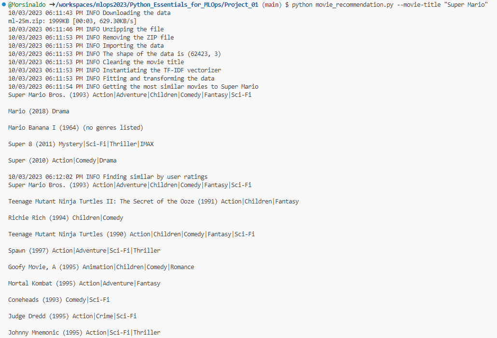
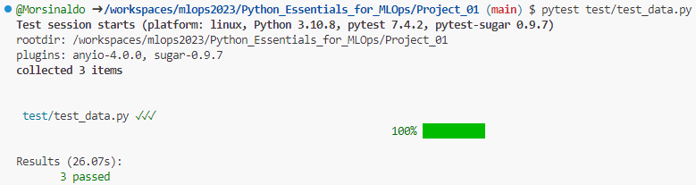
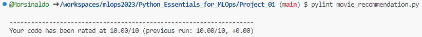
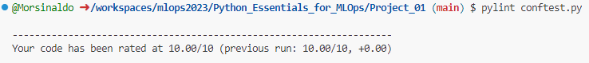
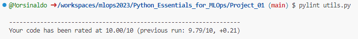

# Build a Movie Recommendation System in Python

## Big picture
Neste projeto, foi desenvolvido um sistema de recomendação de filmes utilizando o Python utilizando algumas das melhores práticas utilizadas para tornar o seu código, mais limpo, mais legível e mais fácil de depurar. O sistema consiste em alguns scripts execuátáveis por meio da linha de comando passando como parâmetros, por exemplo, o título de um filme que você gosta e quantos itens semelhantes você deseja que o sistema te retorne. 

## How to execute

Uma vez que as dependências estejam instaladas, basta você executar o comando abaixo substituindo "movie_title" pelo título do filme que você deseja.

```
python movie_recomendation.py --movie-title "Movie Title"
```

### Execution Example

Vamos tomar o exemplo que você deseja procurar por recomendações de filmes parecidos com Super Mario.

```
python movie_recomendation.py --movie-title "Super Mario"
```

O resultado no seu terminal deve ser algo semelhante ao mostrado na imagem abaixo.



## The code

No arquivo [movie_recomendation.py](./movie_recomendation.py), foi utilizada a arquitetura `try - except` para verificar se o diretório dos dados já existe e depois para realizar o download propriamente dito dos dados a partir da url. Para isso, foi utilizada a biblioteca [tqdm](https://github.com/tqdm/tqdm) para mostrar uma barra de progresso no terminal para que o usuário não fique perdido sem saber uma estimativa do tempo do download ou mesmo se o programa ainda está executando como deveria. Caso ele não consiga realizar isso, o programa irá lançar uma exceção e informar para o usuário qual foi o erro.

```python
try:
    if not os.path.exists("ml-25m"):
        logging.info("Downloading the data")

        download_data(os.getenv("URL"), os.getenv("ZIP_FILENAME"))
    else:
        logging.info("The data is already downloaded")
except requests.exceptions.ConnectionError:
    logging.error("Connection Error")
except requests.exceptions.Timeout:
    logging.error("Timeout Error")
except requests.exceptions.HTTPError:
    logging.error("HTTP Error")
except zipfile.BadZipFile:
    logging.error("The downloaded file is not a valid ZIP file.")
```

Com os dados no seu devido lugar, nós podemos instânciar o objeto que irá receber e processar os argumentos informados na linha de comando, o `ArgumentParser`. Neste ponto, será realizada uma verificação do formato do título informado, o carregamento do conjunto de dados, a limpeza dos caracteres especiais presentes nos títulos.

```python
# create the parser
parser = argparse.ArgumentParser(description="Movie Recommendation System")

# add the arguments
parser.add_argument("--movie_title", type=str, help="The title of the movie")

# parse the arguments
args = parser.parse_args()

# get the movie title
movie_title = args.movie_title

# import the data
logging.info("Importing the data")
movies_df = pd.read_csv("data/movies.csv")

# log the shape of the data
logging.info(f"The shape of the data is {movies_df.shape}")

# clean the movie title
logging.info("Cleaning the movie title")
movies_df["clean_title"] = movies_df["title"].apply(clean_movie_title)
```

Em seguida, instânciou-se um `TfidfVectorizer` para transformar os títulos dos filmes em vetores e, com isso, poder buscar os filmes com os títulos mais parecidos. Ok, isso já é bem legal, mas vamos combinar que podemos fazer melhor do que é isso num é?! Que tal recomendar filmes similares com base no consumo e na nota de outros usários?

```python
# instantiate the TF-IDF vectorizer
logging.info("Instantiating the TF-IDF vectorizer")
tfidf_vectorizer = TfidfVectorizer(ngram_range=(1,2))

# fit the vectorizer and transform the data
logging.info("Fitting and transforming the data")
tfidf_matrix = tfidf_vectorizer.fit_transform(movies_df["clean_title"])

# get the most similar movies
logging.info(f"Getting the most similar movies to {movie_title}")
results = get_most_similar_movies_by_title(movies_df, tfidf_vectorizer, movie_title)
```

No arquivo [ratings.csv](./data/ratings.csv), nós podemos encontrar a nota que cada usuário deu para um determinado `movieId` e, através dessa coluna, nós podemos pegar o respectivo nome do filme no arquivo [movies.csv](./data/movies.csv). A função responsável por realizar essa busca é definida como `find_similar_movies()` e pode ser encontrada no arquivo [utils.py](./utils.py).

```python
# movie_recomendation.py

# read the ratings data
ratings_df = pd.read_csv("data/ratings.csv")

results = find_similar_movies(movies_df, ratings_df, movie_title)
```

## How to add more movies (Pytest)

A cada dia, são lançados novos filmes e, com isso, é desejável manter a nossa base de dados atualizada não é? Então, se você deseja fazer isso sem compromenter a exeução correta do código, eu criei alguns testes que irão amenizar a chance de ocorrer algum problema durante a execução. 

No arquivo [conftest.py](./conftest.py), você irá encontrar uma fixture que irá carregar os datasets em memória para poderem ser utilizados nos testes. Já no arquivo [test_data.py](./test/test_data.py), você irá encontrar testes que verificam, por exemplo, se o tipo de cada coluna está de acordo com o esperado, se há um número mínimo de linhas desejável, se os datasets possuem as colunas com os respectivos nomes esperados, entre outros. Sinta-se livre para adicionar mais testes na sua aplicação, eles são muito importantes e podem economizar muito tempo de depuração dos erros.

Para executar todos os testes, basta você rodar o comando abaixo:

```
pytest
```

Para executar algum arquivo de teste específico, você pode passar o nome do arquivo, por exemplo:

```
pytest test/test_data.py
```

O resultado da execução deste comando pode ser visualizado na imagem abaixo:



## Clean codes Principles

Note que, em relação a [solução original](https://github.com/dataquestio/solutions/blob/master/Mission740Solutions.ipynb), vários nomes de variáveis e de funções foram alterados de forma a deixar o código mais legível, além da modularização de alguns passos do pipeline e da adição do tratamento de exceções e da adição de loggings. Além disso, realizou-se a documentação das funções e, formato docstring e utilizando a dica de tipo, como mostra o exemplo da função abaixo:

```python
def clean_movie_title(raw_movie_title: str) -> str:
    """
    Clean the title of the movie by removing any non-alphanumeric characters

    Args:
        raw_movie_title (str): The raw title of the movie

    Returns:
        movie_title_cleaned (str): The clean title of the movie
    """
    movie_title_cleaned = re.sub("[^a-zA-Z0-9 ]", "", raw_movie_title)
    return movie_title_cleaned
```

## Code style

Note que eu tentei deixar o nome das variáveis da forma mais legível possível, bem como os nomes dos testes. Em adição à docstring, o código ficou mais limpo e mais legível, melhorando assim a sua legibilidade. Em relação ao Pylint, eu consegui uma nota 10/10. Não fique tão obcecado em alcançar a nota máxima. É preciso ter bom censo e ser crítico em relação à algumas coisas como a quantidade de espaços na identação, pois dependendo da resolução da tela que você está olhando, dois espaços podem ser mais interessantes do que quatro. 

Para executar o Pylint, basta você rodar o seguinte comando:

```
pylint filename
```

Abaixo encontram-se alguns exemplos de execução e os seus resultados:

- ```pylint movie_recomendation.py```



- ```pylint conftest.py```



- ```pylint utils.py```


## Copyrights

Este projeto foi adaptado de um `Portfolio Project` do site [Dataquest](https://www.dataquest.io/). Em relação à [solução original](https://github.com/dataquestio/project-walkthroughs/blob/master/movie_recs/movie_recommendations.ipynb), foi realizada a adaptação de um Jupyter notebook com um sistema de recomendação interativo para scripts em python com o intuito de facilitar e viabilizar a utilização do Pylint, do AutoPep8 e da passagem de argumentos através da linha de comando.

## References

- [Ivanovitch's Repository](https://github.com/ivanovitchm/mlops)
- [Build a Movie Recommendation System in Python (Dataquest)](https://github.com/dataquestio/project-walkthroughs/blob/master/movie_recs/movie_recommendations.ipynb)
