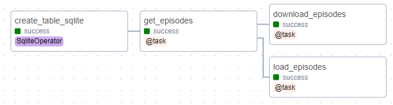
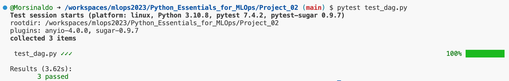
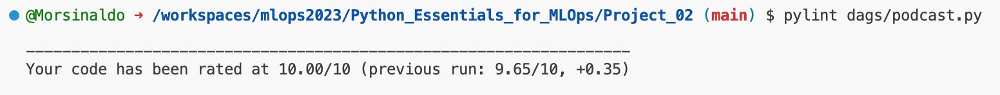
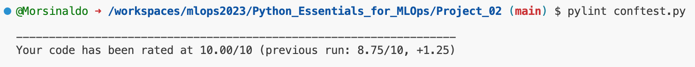
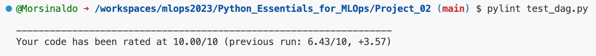

# Airflow Data Pipeline to Download Podcasts

## Introduction 

Without data, machine learning models are unable to learn about the task they seek to automate. Therefore, it is of paramount importance to create mechanisms that perform data extraction, processing, and storage, a process known as a data pipeline.

One of the best tools that aid in this process of creating and automating a data pipeline is [Apache Airflow](https://airflow.apache.org/). With this in mind, this project aims to develop an application using Airflow to automate the collection of podcast episodes, store relevant information in an SQLite database, download audio episodes, and transcribe episodes into text. This automation is configured to run daily.

## How to execute

If you are using Github Codespaces, you do not need to create a virtual environment. However, during the development of this project, we were unable to access the server ports. So, if you run it locally, it is highly recommended to create a virtual environment.

Airflow does not yet support Python version 3.11. Therefore, to create a virtual environment, you can use the following command to create it with version 3.10.

```
python3.10 -m venv airflow
```

To activate the environment, run the command:

```
source ./airflow/bin/activate
```

To install Airflow, run the following commands:

```
AIRFLOW_VERSION=2.7.1
PYTHON_VERSION="$(python --version | cut -d " " -f 2 | cut -d "." -f 1-2)"
CONSTRAINT_URL="https://raw.githubusercontent.com/apache/airflow/constraints-${AIRFLOW_VERSION}/constraints-${PYTHON_VERSION}.txt"
pip install "apache-airflow==${AIRFLOW_VERSION}" --constraint "${CONSTRAINT_URL}"
```

Once installed, you can run the application with the following command:

```
airflow standalone
```

This will create the configuration folder at `~/airflow` and will run it at `localhost:8080`. The next step is to change the file at `~/airflow/config.cfg` with the path to your DAGs. In my case, it looked like this:

```
dags_folder = /Users/morsinaldo/Desktop/mlops2023/Python_Essentials_for_MLOps/Project_02/dags
load_examples = False
```

To install necessary dependencies, use `pip` command

```
pip install -r requirements.txt
```

To install SQLite, let's run the following steps:

```
wget https://www.sqlite.org/snapshot/sqlite-snapshot-202309111527.tar.gz
tar -xzvf sqlite-snapshot-202309111527.tar.gz
cd sqlite-snapshot-202309111527
./configure
make
sudo make install
sqlite3 --version
```

At the path `your_path/mlops2023/Python_Essentials_for_MLOps/Project_02/dags`, create a database in a new terminal session:

```
sqlite3 episodes.db
.databases
.quit
```

Create a connection to the database

```
airflow connections add 'podcasts' --conn-type 'sqlite' --conn-host 'your_path/mlops2023/Python_Essentials_for_MLOps/Project_02/dags/episodes.db'
```

In [podcast.py](./dags/podcast.py) file, adjust the `PROJECT_FOLDER` variable to your machine

```python
PROJECT_FOLDER = "/home/morsinaldo/Desktop/mlops2023/Python_Essentials_for_MLOps/Project_02"
```

```
airflow connections get podcasts
```

Now, just run `airflow standalone` again to load the changes made. If you click on the `podcast_summary` DAG graph, you will find a graph similar to the one in the image below.



## The code

In general, we first have the creation of a DAG (Directed Acyclic Graph) named 'podcast_summary', which was configured to run daily starting from May 30, 2022. Below, the code shows the creation of the DAG and the definition of the `podcast_summary()` function, which contains the execution of the `tasks`. The complete code can be found in [podcast.py](./dags/podcast.py).

```python
# create a DAG
@dag(
    dag_id='podcast_summary',
    schedule="@daily",
    start_date=pendulum.datetime(2023, 9, 29),
    catchup=False,
)

def podcast_summary():
    """
    Definition of the DAG.

    Returns:
        None
    """

    # create the directory for the episodes
    if not os.path.exists("episodes"):
        os.makedirs("episodes")

    # create the database
    database = create_database()

    # fetch episodes
    podcast_episodes = get_episodes()

    # set downstream dependencies
    database.set_downstream(podcast_episodes)

    # load episodes
    load_episodes(podcast_episodes)

    # download episodes
    download_episodes(podcast_episodes)

    # transcribe episodes
    # speech_to_text()
```

The first defined task was `get_episodes()`, which is responsible for downloading data through a GET request to the defined URL, transforming it into dictionary format, and returning the episodes, which are then stored in the database. To facilitate unit testing, each task returns a function call. In this way, tests were performed on the functions that the tasks execute.

```python
def fetch_data() -> list:
    """
    Downloads podcast episodes as audio files.

    Returns:
        audio_files (list): A list of dictionaries containing audio file information.
    """
    try:
        # download data
        data = requests.get(PODCAST_URL, timeout=15)

        # transform to dict
        feed = xmltodict.parse(data.text)

        # get episodes
        episodes = feed["rss"]["channel"]["item"]
        logging.info("Found %s episodes.", len(episodes))
        return episodes
    except requests.RequestException as e:
        logging.error("Error fetching podcast episodes: %s", str(e))
        raise
    except Exception as general_error:
        logging.error("Error parsing podcast episodes: %s", str(general_error))
        raise


@task()
def get_episodes() -> list:
    """
    Task to fetch podcast episodes from the RSS feed.

    Returns:
        episodes (list): A list of dictionaries containing podcast episode information.
    """
    return fetch_data()
```

The next task is defined as `load_episodes()`, and it takes the data of the episodes obtained in the previous step as input. From this, it establishes a connection with the SQLite database, retrieves the episodes already stored in the database, checks for new episodes by comparing the links of the obtained episodes with those already stored, and finally inserts the new episodes into the database.

```python
def load_data(episodes: list) -> list:
    """
    Loads new podcast episodes into the database.

    Args:
        episodes (list): A list of dictionaries containing podcast episode information.

    Returns:
        new_episodes (list): A list of new episode records.
    """
    try:
        # connect to the database
        hook = SqliteHook(sqlite_conn_id="podcasts")

        # get stored episodes
        stored_episodes = hook.get_pandas_df("SELECT * from episodes;")
        new_episodes = []

        # check for new episodes
        for episode in episodes:
            if episode["link"] not in stored_episodes["link"].values:
                filename = f"{episode['link'].split('/')[-1]}.mp3"
                new_episodes.append([episode["link"],
                                     episode["title"],
                                     episode["pubDate"],
                                     episode["description"],
                                     filename])

        # insert new episodes into the database
        hook.insert_rows(table='episodes',
                         rows=new_episodes,
                         target_fields=["link",
                                        "title",
                                        "published",
                                        "description",
                                        "filename"])
        logging.info("Loaded %s new episodes.", len(new_episodes))
        return new_episodes
    except Exception as e:
        logging.error("Error loading episodes into the database: %s", str(e))
        raise

@task()
def load_episodes(episode_data: list) -> list:
    """
    Task to load new podcast episodes into the database.

    Args:
        episode_data (list): A list of dictionaries containing podcast episode information.

    Returns:
        new_episodes (list): A list of new episode records.
    """
    return load_data(episode_data)
```

The other task is defined as `download_episodes()`, which receives the list of episodes from the first task and is responsible for downloading the episodes and storing them in the `episodes` folder.

```python
def download_data(episodes: list) -> list:
    """
    Download the specified podcast episodes.

    Args:
        episodes (list): A list of dictionaries containing podcast episode information.

    Returns:
        audio_files (list): A list of dictionaries containing audio file information.
    """

    audio_files = []

    for episode in episodes:
        try:
            name_end = episode["link"].split('/')[-1]
            filename = f"{name_end}.mp3"
            audio_path = os.path.join(EPISODE_FOLDER, filename)
            if not os.path.exists(audio_path):
                logging.info("Downloading episode %s", episode["link"])
                audio = requests.get(episode["enclosure"]["@url"], timeout=15)
                with open(audio_path, "wb+") as file:
                    file.write(audio.content)
            audio_files.append({
                "link": episode["link"],
                "filename": filename
            })
        except requests.RequestException as e:
            logging.error("Error downloading podcast episode: %s", str(e))
            raise
        except IOError as e:
            logging.error("Error writing podcast episode to disk: %s", str(e))
            raise
        except Exception as general_error:
            logging.error("Error downloading podcast episode: %s", str(general_error))
            raise

    return audio_files

@task()
def download_episodes(episode_data: list) -> list:
    """
    Task to download the specified podcast episodes.

    Args:
        episode_data (list): A list of dictionaries containing podcast episode information.

    Returns:
        audio_files (list): A list of dictionaries containing audio file information.
    """
    return download_data(episode_data)
```

The final step of the DAG is called `transcribe_episodes()` and is responsible for connecting to the database, retrieving episodes that have not yet been transcribed, loading a Vosk speech transcription model, performing audio-to-text transcription of the episodes in chunks, and finally updating the database with the transcriptions of the episodes. Just like in the original example, this function was not used in the script execution.

## Pytest

To ensure that all components and tasks are working correctly, some didactic tests were created to check the result of certain steps.

In this sense, the file [conftest.py](./conftest.py) contains the fixture for the overall DAG and the episode download. In the file [test_dag.py](./test_dag.py), you will find tests that verify, for example, if the database instance is correct, if episode downloads are happening correctly, and if the audio transcription task model is correct. Feel free to add more tests to your application; they are very important and can save a lot of debugging time.

To run the tests, simply execute the command below:

```
pytest
```

To run a specific test file, you can pass the file name, for example:

```
pytest test_dag.py
```

The result of executing this command can be seen in the image below:



## Code style

Please note that I tried to make variable names as readable as possible, as well as test names. In addition to the docstring, the code became cleaner and more readable, thus improving its overall readability. Regarding Pylint, I achieved a score of 10/10. However, don't become overly obsessed with reaching the maximum score. It's essential to use good judgment and be critical about certain things, such as the number of spaces in indentation, as it may vary depending on the screen resolution you are working with; sometimes two spaces might be more appropriate than four.

To run Pylint, you can simply execute the following command:

```
pylint filename
```

Below are some examples of execution and their results:

- ```pylint movie_recomendation.py```



- ```pylint conftest.py```



- ```pylint utils.py```



## Copyrights

This project was adapted from a `Portfolio Project` on the [Dataquest](https://www.dataquest.io/) website. In relation to the [original solution](https://github.com/dataquestio/project-walkthroughs/blob/master/podcast_summary/podcast_summary.py), adaptations were made to external functions to facilitate the execution of unit tests.