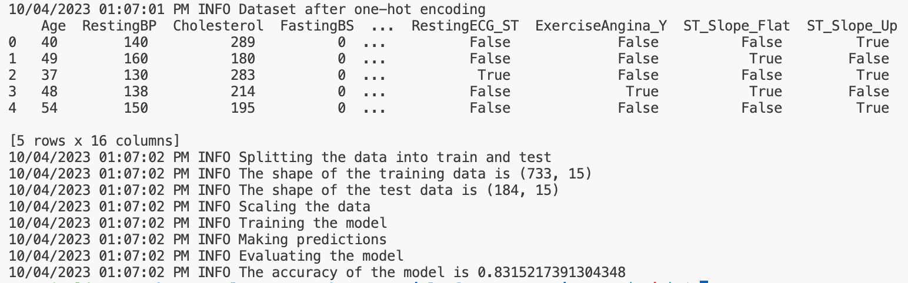
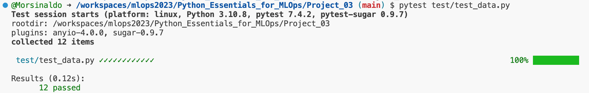
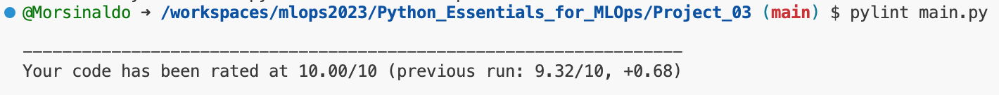
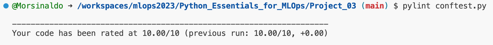
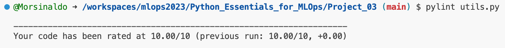

# Predicting Heart Disease

## Big Picture
The World Health Organization (WHO) approximates that 17.9 million individuals succumb to cardiovascular diseases (CVDs) annually.

Numerous risk factors may be conducive to the onset of CVD in an individual, including an unhealthy diet, insufficient physical activity, or mental health disorders. The early identification of these risk factors in individuals has the potential to prevent a substantial number of premature deaths.

In this project, we will use the [Kaggle dataset](https://www.kaggle.com/datasets/fedesoriano/heart-failure-prediction/) and build a K-Nearest Neighbors classifier to accurately predict the likelihood of a patient having a heart disease in the future.

## How to execute

Once you have created your preferred virtual environment and installed the dependencies, you can simply activate it and execute the following command:

```
python main.py
```

To allow greater flexibility in script usage via the command line, it enables the passing of two parameters:

- test_size: allows the user to define the proportion used for the test set during training. Accepts float values between 0 and 1. Default: 0.2
- hyperparameter_tuning: allows the user to specify whether they want to perform a Bayesian search for the best model hyperparameters. Accepts values True or False. Default: False

### Execution Example

Assuming you want a 15% test proportion and wish to perform hyperparameter tuning:

```
python main.py --test_size 0.15 --hyperparameter_tuning True
```

The final output print of the code should look something like this:



## The code

In the file [main.py](./main.py), the `try - except` architecture was used to perform dataset reading, exploratory data analysis (EDA), and feature cleaning. The auxiliary functions used in the script can be found in the file [utils.py](./utils.py), and the mentioned code is as follows.

```python
# read the data
try:
    df_heart_disease = pd.read_csv('./data/heart_disease_prediction.csv')
except Exception as e:
    logging.error("Error loading data")
    logging.error(e)

# EDA
try:
    logging.info("Starting EDA")
    if not os.path.exists("images"):
        os.makedirs("images")
    eda_heart_disease(df_heart_disease)
except Exception as e:
    logging.error("Error during EDA")
    logging.error(e)

# Data Cleaning
try:
    logging.info("Starting data cleaning")
    df_heart_disease = clean_data(df_heart_disease)
except Exception as e:
    logging.error("Error during data cleaning")
    logging.error(e)
```


Once the dataset is clean, feature selection was performed, and a heatmap was plotted to display the column correlations. Subsequently, the data was split into training and testing sets, with a default ratio of 80% for training and 20% for testing. However, the user can define a different value using the `test_size` parameter when running the script from the command line. The code below demonstrates the execution of the mentioned commands.

```python
# Feature selection
df_heart_disease = pd.get_dummies(df_heart_disease, drop_first=True)
logging.info(f"Dataset after one-hot encoding \n {df_heart_disease.head()}")

# plot the correlation matrix
fig = plt.figure(figsize=(16, 15))
sns.heatmap(df_heart_disease.corr(), annot=True)
plt.savefig("./images/correlation_matrix.png")

# split the data into train and test
X = df_heart_disease.drop("HeartDisease", axis=1)
y = df_heart_disease["HeartDisease"]

logging.info("Splitting the data into train and test")
X_train, X_test, y_train, y_test = train_test_split(X, y, test_size=args.test_size, random_state=42)

# log the shape of the data
logging.info("The shape of the training data is %s", X_train.shape)
logging.info("The shape of the test data is %s", X_test.shape)
```

Next, an instance of the MinMaxScaler object is created to scale the column values, and the actual training of the KNeighborsClassifier model is performed. With the trained model, predictions are made, and the model is evaluated using the accuracy metric. The code for this is shown below.

```python
# scale the data
logging.info("Scaling the data")
scaler = MinMaxScaler()
X_train_scaled = scaler.fit_transform(X_train)
X_test_scaled = scaler.transform(X_test)

# train the model
logging.info("Training the model")
knn = KNeighborsClassifier()
knn.fit(X_train_scaled, y_train)

# make predictions
logging.info("Making predictions")
y_pred = knn.predict(X_test_scaled)

# evaluate the model
logging.info("Evaluating the model")
accuracy = accuracy_score(y_test, y_pred)
logging.info("The accuracy of the model is %s", accuracy)
```

If the user desires, they can also perform hyperparameter tuning of the model through a grid parameter search. By default, this option is set to False, but the user can activate it by setting the `hyperparameter_tuning` parameter to True when executing the script via the command line. The code that performs this procedure is shown below.

```python
if args.hyperparameter_tuning == True:
    # define the hyperparameters
    hyperparameters = dict(n_neighbors=[1, 3, 5, 7, 9, 11, 13, 15],
                           weights=["uniform", "distance"],
                           metric=["euclidean", "manhattan", "minkowski"])

    # define the search
    logging.info("Instantiating the search")
    search = GridSearchCV(estimator=knn,
                          param_grid=hyperparameters,
                          scoring="accuracy",
                          n_jobs=-1)

    # fit the search
    logging.info("Fitting the model")
    best_model = search.fit(X_train_scaled, y_train)

    # summarize best
    logging.info("Best accuracy: %s", best_model.best_score_)
    logging.info("Best hyperparameters: %s", best_model.best_params_)

    # make predictions
    logging.info("Making predictions")
    y_pred = best_model.predict(X_test_scaled)

    # evaluate the model
    logging.info("Evaluating the model")
    accuracy = accuracy_score(y_test, y_pred)
```


## How to add more data (Pytest)

Every day, new data is generated, and as a result, it is desirable to keep our database up to date, isn't it? So, if you wish to do this without compromising the correct execution of the code, I have created some tests that will reduce the chance of any problems occurring during execution.

In the file [conftest.py](./conftest.py), you will find a fixture that loads the dataset into memory to be used in the tests. In the file [test_data.py](./test/test_data.py), you will find tests that check, for example, if the data types of each column are as expected, if all columns are present, if categorical columns have the expected values, if numeric columns have values within a certain range, and more. Feel free to add more tests to your application; they are very important and can save a lot of debugging time.

To run the tests, simply execute the command below:

```
pytest
```

To run a specific test file, you can pass the file name, for example:

```
pytest test/test_data.py
```

The result of executing this command can be seen in the image below:




## Clean codes Principles

Note that, compared to the [original solution](https://github.com/dataquestio/solutions/blob/master/Mission740Solutions.ipynb), several variable and function names have been changed to make the code more readable. Additionally, some steps of the pipeline have been modularized, exception handling has been added, and logging has been incorporated. Furthermore, function documentation has been provided, in docstring format, and using type hints, as demonstrated in the example function below:

```python
def clean_data(df: pd.DataFrame) -> pd.DataFrame:
    """
    Function to replace the zero values in the RestingBP 
    and Cholesterol columns with the median of the respective group.

    Args:
        df (pd.DataFrame): The dataframe to be cleaned

    Returns:
        df_clean (pd.DataFrame): The cleaned dataframe
    """

    # only keep non-zero values for RestingBP
    df_clean = df[df["RestingBP"] != 0]
    logging.info(f"Dataset has {df_clean.shape[0]} non-zero values for RestingBP")

    # get the lines where HeartDisease is 0
    df_heartdisease_mask = df_clean["HeartDisease"]==0
    logging.info(f"Dataset has {df_heartdisease_mask.sum()} lines where HeartDisease is 0")

    # filter the lines where HeartDisease is 0
    df_cholesterol_without_heartdisease = df_clean.loc[df_heartdisease_mask, "Cholesterol"]
    df_cholesterol_with_heartdisease = df_clean.loc[~df_heartdisease_mask, "Cholesterol"]

    logging.info(f"Replace the zero values with the median of the respective group")
    # replace the zero values with the median of the respective group
    df_clean.loc[df_heartdisease_mask, "Cholesterol"] = df_cholesterol_without_heartdisease.replace(to_replace = 0, value = df_cholesterol_without_heartdisease.median())
    df_clean.loc[~df_heartdisease_mask, "Cholesterol"] = df_cholesterol_with_heartdisease.replace(to_replace = 0, value = df_cholesterol_with_heartdisease.median())

    logging.info(f"Describe of RestingDB and Cholesterol \n {df_clean.describe()}")

    return df_clean
```

Please note that I have tried to make variable names as readable as possible, as well as test names. In addition to the docstring, the code has become cleaner and more readable, thus improving its overall readability. Regarding Pylint, I achieved a score of 10/10. However, don't become overly obsessed with reaching the maximum score. It's essential to use good judgment and be critical about certain things, such as the number of spaces in indentation, as it may vary depending on the screen resolution you are working with; sometimes two spaces might be more appropriate than four.

To run Pylint, you can simply execute the following command:

```
pylint filename
```

Below are some execution examples and their results:

- ```pylint movie_recomendation.py```



- ```pylint conftest.py```



- ```pylint utils.py```



## Copyrights

This project was adapted from a `Guided Project`` on the [Dataquest](https://www.dataquest.io/) website, specifically from the [Machine Learning in Python](https://app.dataquest.io/learning-path/machine-learning-in-python-skill) learning path. Compared to the [original solution](https://github.com/dataquestio/project-walkthroughs/blob/master/movie_recs/movie_recommendations.ipynb), it involved transforming a Jupyter notebook into Python scripts to facilitate and enable the use of Pylint, AutoPep8, and command-line argument passing.