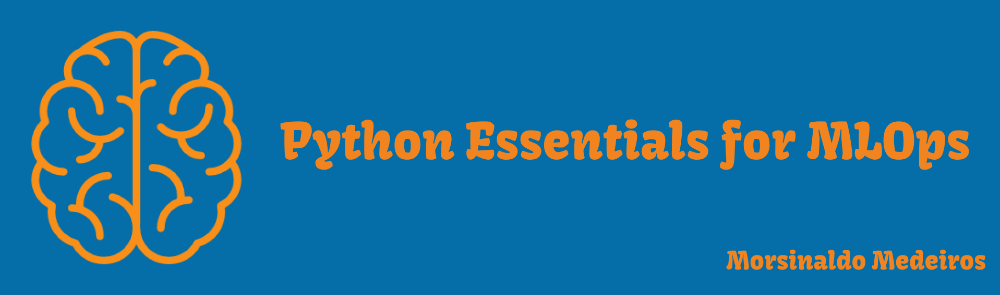

# Python Essentials for MLOps

Before delving into the fabulous world of Machine Learning Operations (MLOps), there are a set of best practices to follow that enhance code readability and maintainability. After all, in a real project with a model in production, if an error occurs, other developers will read your code to identify the problem. Standardized indentation and logging are very useful in this regard. Additionally, if you need to retrain the model and the database needs to be processed, you should check for invalid columns, ensure an adequate number of instances, and more. In this context, unit tests can greatly simplify this process.



With this in mind, three projects have been developed to explore some of these best practices, which will be explained in more detail below. You can also check out [my video]() explaining the overall functionality of each project.

## Projetos Desenvolvidos
   - [Movie System Recomendation](./Project_01/): In this project, a movie recommendation system was developed, where the user provides a title, and the algorithm searches for the most similar movie titles in its database, providing movie recommendations based on the preferences of other users with similar consumption patterns.
   - [Airflow Data Pipeline to Download Podcasts](./Project_02/): In this project, a graph-based pipeline using Apache Airflow was developed for the automatic extraction of podcast files. This ensures that the data is already extracted, processed, and stored for consumption by a machine learning model, for example.
   - [Predicting Heart Disease](./Project_03/): In this project, a script was developed to automate the training of a model capable of predicting heart diseases based on a patient's clinical data. The user can also choose whether to perform hyperparameter tuning and define the percentage of the dataset to be used for testing.

## Requirements/Tecnologies

- Python 3.8+
- Python packages: 
   - airflow
   - pylint
   - tqdm
   - pytest
   - pytest-sugar
   - requests
   - numpy
   - pandas
   - xmltodict
   - python-dotenv

   You can find the complete list with the respective versions in the [requirements.txt](./requirements.txt) file.

## Instalation Instructions

1. Ensure you have Python version 3.8+ installed.
2. Clone the repository: 
   ```
   git clone https://github.com/Morsinaldo/mlops2023.git
   ```
3. Navigate to the `Python_Essentials_for_MLOps` directory.
   ```
   cd Python_Essentials_for_MLOps
   ```
4. Install the required libraries: 
   ```
   pip install -r requirements.txt
   ``` 
5. Navigate to a specific project, [Project 01](./Project_01/), for example.
   ```
   cd Project 01
   ```
6. Run the project:
   ```
   python movie_recommendations.py --movie-title "Movie Title"
   ```
   replacing `Movie Title` with the title of the movie you want to get recommendations for.
6. To run the tests, run the following command:
   ```
    pytest 
   ```
7. To run the linter, run the following command:
   ```
    pylint movie_recommendations.py
   ```
8. Alternatively, you can use **GitHub Codespaces** for a quick setup:
   - In the main repository page, click on the `Code` button and select `Codespaces`.
   - From the dropdown, select `Open with Codespaces` or `Create codespace on main`.
   - This will initiate a Codespace environment where you can code directly in the browser without local setup.


## Some best Practices

### Virtual Environment

Hoje em dia, utiliza-se muito cloud computing para hospedar aplicações e isso possui um custo associado. Então, quanto menos dependências a aplicação tiver, melhor. Nesse sentido, a criação de um ambiente virtual simula uma "caixa de areia" que contém as dependências que irão ser necessárias para a aplicação executar da forma correta. Além disso, a criação desse ambiente evita que uma bilbioteca específica de um projeto apresente conflito com uma bilbioteca de outro projeto, por exemplo.

Para tratar isso, existem alguns gerenciadores de pacotes que facilitam o tratamento desses conflitos. Como sugestão, eu apresento o [Anaconda](https://anaconda.org), o [Poetry](https://python-poetry.org) e o [Python Venv](https://docs.python.org/3/library/venv.html).


These days, cloud computing is widely used to host applications, and it comes with associated costs. Therefore, the fewer dependencies an application has, the better. In this regard, creating a virtual environment simulates a "sandbox" that contains the dependencies needed for the application to run correctly. Moreover, creating this environment prevents a specific library from one project from conflicting with a library from another project, for example.

To address this, there are package managers that make handling these conflicts easier. As a suggestion, I present [Anaconda](https://anaconda.org), [Poetry](https://python-poetry.org), and [Python Venv](https://docs.python.org/3/library/venv.html).

### Command Line Interface

The Command Line Interface (CLI) is the means by which we run the scripts we are developing, and one of the possibilities that this medium offers is the ability to pass parameters for execution. For example, you can include a parameter that defines which steps of your pipeline the script will execute, the proportion of the split between training and testing, or even hyperparameters for training. The limit is your imagination. 😃

In general, when we are learning machine learning, we tend to use Jupyter Notebooks. They are quite useful when conducting experiments. However, despite platforms like Amazon SageMaker allowing the deployment of applications using Jupyter Notebooks, this is not very common or efficient. Therefore, a good practice is to develop scripts that can be executed via the CLI.

Recommended reading: Data Science at the Command Line - Jeroen Jansses 

### Clean Code Principles

Once we agree to write scripts, what's the best way to do it? It's not just about writing code as if there were no tomorrow. There are some best practices that can be followed to write cleaner code, as presented in books like "Clean Code in Python" and "Fluent Python":

1. **Writing clean code**: Use *meaningful names*, avoid abbreviations and single letters. Additionally, you can indicate the variable type and use names that describe the meaning of that variable, function, etc., as concisely as possible. Remember that long names are not the same as descriptive names.

2. **Writing modular code**: Don't repeat yourself (DRY). Abstract out logic to improve readability. Functions should do one thing. Modularized code also facilitates unit testing.

3. **Refactoring**: Sometimes, you can modularize your code further or even reduce execution time by improving the internal structure without changing external functionality. For example, if you have a nested loop, you can reduce complexity using list comprehensions or dictionaries.

4. **Efficient code and documentation**: Knowing how to write code that runs efficiently is another essential skill in software development. Note that one point is related to the other. The example above also applies to this one. When you're performing lots of different transformations on large amounts of data, this can make orders of magnitude of difference in performance.

5. **Documentation**: It's fundamental for someone reading your code. How can someone who has never seen your code before look at it and understand what you did in a simple way? Concise one-line comments can be very useful to explain what a command does, and docstrings for functions and classes using data type annotations greatly facilitate understanding the purpose of that entity.
6. Following PEPs: Python Enhancement Proposals (PEP) is a set of guidelines and recommendations for writing Python code in a clearer, more readable, and consistent manner. It defines a coding style that helps developers produce more organized and easily understandable code. Some notable PEPs include:

   - [PEP 8 – Style Guide for Python Code](https://peps.python.org/pep-0008/)
   - [PEP 3107 – Function Annotations](https://peps.python.org/pep-3107/)
   - [PEP 0484 – Type Hints](https://peps.python.org/pep-0484/)
   - [PEP 0526 – Syntax for Variable Annotations](https://peps.python.org/pep-0526/)
   - [PEP 0557 – Data Classes](https://peps.python.org/pep-0557/)
   - [PEP 0585 – Type Hinting Generics In Standard Collections](https://peps.python.org/pep-0585/)

Great! This will help many other people, but how can I make this process faster? Fortunately, there are already some libraries that check our code for non-compliance with the standards and inform what is not in accordance. This process is called Linting.

### Linting

In this regard, there are several tools that can assist us in writing standardized code. The first of these is [autopep8](https://pypi.org/project/autopep8/), which generally automates the formatting of our code to the PEP8 standard, making changes directly to the file. [Pylint](https://www.pylint.org/) is a library that analyzes and generates a score from 0 to 10 for our code, informing the user of non-compliance with the standard, and allowing the user to make the necessary modifications. [pycodestyle](https://pypi.org/project/pycodestyle/) is quite similar to pylint, with the difference that it doesn't generate a score; it simply indicates the modifications needed. The linting tools will be shown in more detail in the context of each project.
### Error Handling

This point is very important because in a production scenario, many errors can occur, and we must be prepared to mitigate them as quickly as possible. For example, some errors that can occur are:

   - Data Loading Failure: Imagine a model that is retrained every day with new data from the previous day. One day, the data source changes without notice, and the pipeline cannot handle this change properly. As a result, the model is not trained that day, impacting various downstream applications.
   - API Rate Limiting: Suppose your pipeline downloads data from an external API. If the API imposes a rate limit and your system does not handle this exception, the pipeline may fail or get stuck in an infinite loop, causing a series of downstream failures.
   - Resource Exhaustion: Imagine a machine learning model that provides product recommendations on an e-commerce website. If the model encounters an error that is not handled properly during a peak sales period, it will result in a significant loss of revenue.
   - Timeout Errors: Poor handling of timeout errors can cascade, causing a failure in multiple dependent systems. The more comprehensive the pipeline, the greater the potential damage.

In light of this, Python provides [documentation](https://docs.python.org/3/tutorial/errors.html) on this topic, covering both standard error handling and custom error handling.
### Pytest

With standardized, documented, and working code for your use case, are you ready to put it into production? Hold on, your code may be working perfectly for your use case, but what if edge cases occur? How will your code behave? An edge case is a problem or situation that occurs only at an extreme (maximum or minimum) operating parameter.

A great way to handle this is through testing, and Python, in particular, has a tool called [Pytest](https://docs.pytest.org/en/7.4.x/) that offers various features to facilitate this process. One of them is the Fixture, which allows you to instantiate an object from a dataset or a model, for example, and use it in multiple tests without having to instantiate it in each one.

This practice requires you to spend a little more time thinking about the errors that can occur, but it also saves you much more time in the future when looking for errors in your code. Of course, it's humanly impossible to think of all the cases that can happen, but you can start by asking yourself, for example:

- "If my application is expecting to receive a CSV file, what happens if it receives an XLSX or Parquet file?"
- "If my function expects to receive a dataset to process a specific column, what happens if the column is null?"

Test it and handle it in your code so that the test passes! When you start thinking about these situations, you begin to get into a rhythm and think of more and more scenarios. 😄

### Logging

Once the ML has been deployed, it needs to be monitored. One of the most elegant ways to do this is by using the [logging](https://docs.python.org/3/library/logging.html) library, as it allows the user to define different logging levels, message formats, whether to save to a file or just display in the terminal, and more. This allows us to later filter messages by a specific level or date, for example. Among the available levels are:

   - DEBUG: detailed information for debugging purposes
   - INFO: general confirmations that things are working as expected 
   - WARNING: an indication that something unexpected happened or may happen soon but the program still works as expected 
   - ERROR: due to a severe problem, the software has not been able to perform some function
   - CRITICAL: a very severe error that will likely lead to the application terminating

### Extra readings

The practices mentioned above are just the tip of the iceberg in the world of MLOps. There are many more that can be incorporated depending on your project's goals, your company's culture, and other factors. As a reading suggestion, if you want to delve deeper into this topic, the following references stand out:

   - [Clean Code in Python](https://www.amazon.com/Clean-Code-Python-maintainable-efficient/dp/1800560214/ref=sr_1_1?crid=T8VO8D93FZQP&keywords=clean+code+in+python&qid=1696419564&sprefix=clean+code+in+%2Caps%2C196&sr=8-1)
   - [Clean Architecture](https://www.amazon.com/Clean-Architecture-Craftsmans-Software-Structure/dp/0134494164/ref=sr_1_1?crid=B68I1FZKKCOM&keywords=clean+architecture&qid=1696419582&sprefix=clean+a%2Caps%2C240&sr=8-1)
   - [Conventional Commits](https://gist.github.com/qoomon/5dfcdf8eec66a051ecd85625518cfd13)
   
## Extras

- Certificate of completion for the course: [Intermediate Python for Web Development](https://app.dataquest.io/view_cert/6KK9V21038O0ZU3ECJ8M).
- Explanaiton video: [Loom]().
## References

- [Ivanovitch's Repository](https://github.com/ivanovitchm/mlops)
- [Data Science at the Command Line - Jeroen Jansses](https://datascienceatthecommandline.com)
- [Build a Movie Recommendation System in Python (Dataquest)](https://github.com/dataquestio/project-walkthroughs/blob/master/movie_recs/movie_recommendations.ipynb)
- [Build an Airflow Data Pipeline to Download Podcasts (Dataquest)](https://github.com/dataquestio/project-walkthroughs/blob/master/podcast_summary/podcast_summary.py)
- [Guided Project: Predicting Heart Disease (Dataquest)](https://github.com/dataquestio/solutions/blob/master/Mission740Solutions.ipynb)